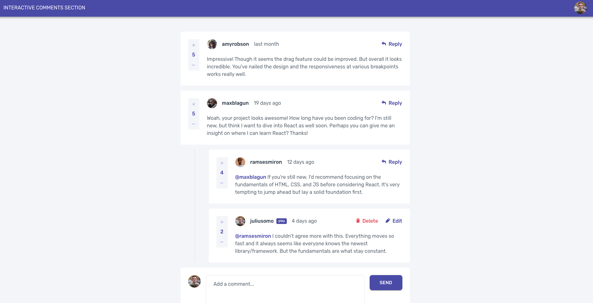

# Frontend Mentor - Interactive comments section solution

This is a solution to the [Interactive comments section challenge on Frontend Mentor](https://www.frontendmentor.io/challenges/interactive-comments-section-iG1RugEG9). Frontend Mentor challenges help you improve your coding skills by building realistic projects. 

## Table of contents

- [Overview](#overview)
  - [The challenge](#the-challenge)
  - [Screenshot](#screenshot)
  - [Links](#links)
- [My process](#my-process)
  - [Built with](#built-with)
  - [What I learned](#what-i-learned)
- [Author](#author)

## Overview

### The challenge

Users should be able to:

- View the optimal layout for the app depending on their device's screen size
- See hover states for all interactive elements on the page
- Create, Read, Update, and Delete comments and replies
- Upvote and downvote comments
- **Bonus**: If you're building a purely front-end project, use `localStorage` to save the current state in the browser that persists when the browser is refreshed.
- **Bonus**: Instead of using the `createdAt` strings from the `data.json` file, try using timestamps and dynamically track the time since the comment or reply was posted. (implemented)

### Behaviour

- Comments/replies are ordered by the time added.
- Replying to a comment adds the new reply to the bottom of the nested replies within that comment.
- A confirmation modal should pop up before a comment or reply is deleted.
- Adding a new comment or reply uses the `currentUser` object from within the `data.json` file.
- You can only edit or delete your own comments and replies.

### Screenshot



### Links

- Live Site URL: [Interactive Comments Section](https://nekopudding.github.io/interactive-comments-section)

## My process

### Built with
- HTML & CSS
- Flexbox
- [MUI](https://mui.com/) - Components library for react
- [React](https://reactjs.org/) - web framework


### What I learned
- using react-tracked to easily access global states
- using recursive components to format replies
- using `<br/>` to give input line breaks
- use `text.trim().length === 0` to check for empty messages
- searching and editing arrays of objects (CommentBox.jsx)
```js
let indices = findIndex(id);
if (indices.c !== -1 && indices.r === -1) {
  updatedComments[indices.c] = {...updatedComments[indices.c], content: "\0"}
} else if (indices.r !== -1 && indices.c !== -1) {
  updatedComments[indices.c].replies[indices.r] = {...updatedComments[indices.c].replies[indices.r], content: "\0"}
}
```
- reordering comments using [splice](https://stackoverflow.com/questions/2440700/reordering-arrays) and finding max in comment list

## Author

- Website - [Dean Yang](https://nekopudding.github.io/portfolio/) (In development)
- Frontend Mentor - [@nekopudding](https://www.frontendmentor.io/profile/nekopudding)

